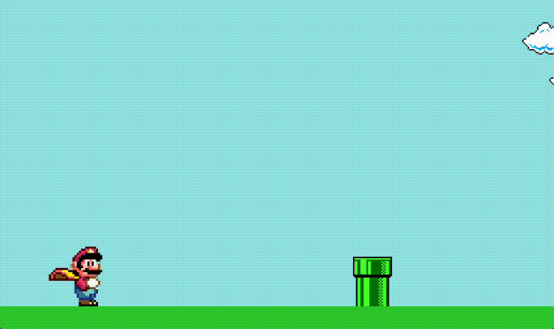
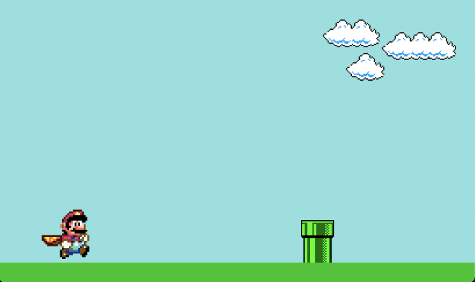
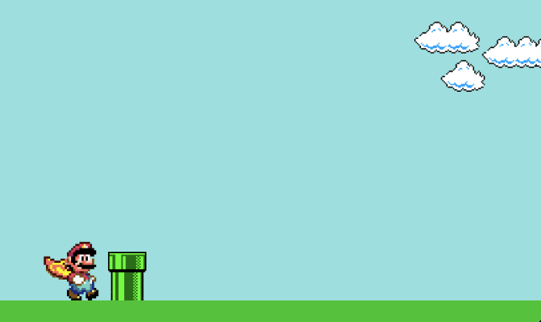
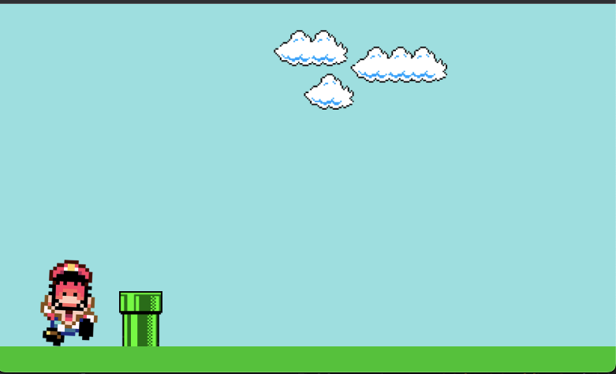

# Mario - ReactJS - Base

Esse repositório servirá como base para desenvolver o jogo do Mario em ReactJS.

**O repositório contém:**

- Arquivos de imagens;
- Arquivo `App.jsx` para construção do jogo, com as imagens devidamente importadas;
- Arquivo `App.css` para construção do estilo.

**Comportamentos**

- O `Cano` deve se movimentar infinitamente da esquerda para a direita;
- O `Mario` deve pular assim que qualquer tecla seja pressionada;
- Ao encostar no `Cano`:
  - O `Mario` deve mudar a imagem para a versão `GameOver`;
  - A animação do `Cano` deve pausar;
  - O jogo deve reiniciar caso qualquer tecla seja pressionada.

## Funcionamento

## Imagens de Referência

### Cenário 1

### Cenário 2

### Jogador ao encostar no Cano

